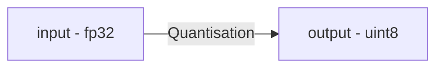
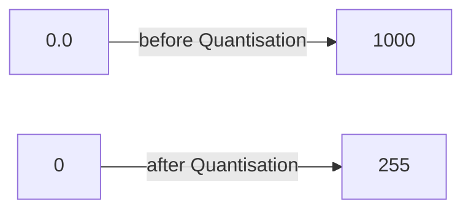
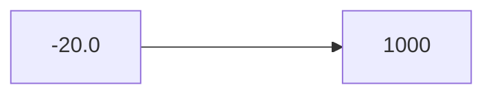
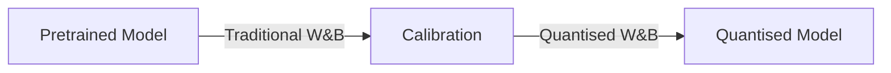
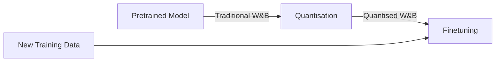
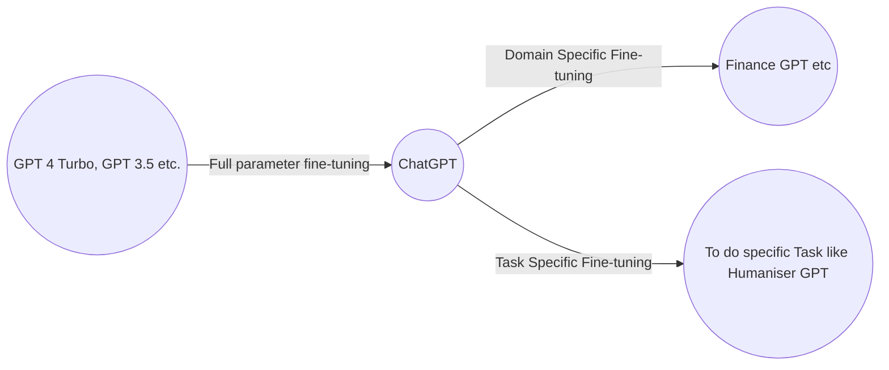

# LLM Finetuning

# Quantization

**Conversion from higher memory format to a lower memory format.**
Ex: FP 32 - Full Precision each parameter in 32 bits

For larger models like Llama-2 70b; it has 70 billion parameters.
Too costly/not economical to store somewhere, will resolve this converting fp32 to int8.
Now, *Inference* is quicker and economical.
Makes fine-tuning easier, though it introduces loss.

## How to perform Quantization

### **Symmentric unit8 Quantisation** - Similar to Batch Normalisation.

Ex : 

To scale it we use min-max scalar
$$
scale = {x_{max} - x_{min}\over q_{max} - q_{min}}
$$
and round it off
### **Assymmentric Quantisation** 

If data is skewed

To scale it we use min-max scalar
$$
scale = {x_{max} - x_{min}\over q_{max} - q_{min}}+zero\_point
$$
and round it off

## Post Training Quantisation (PTQ) : 

There is a loss, leads to reduced accuarcy.
## Quantisation Aware Training (QAT) :

As training data is later provided not depending on pretrained w&b accuracy is well maintained.

# LoRA and QLORA

## Full Parameter Fine-tuning

### Need to update all the weights(parameters) : 
### Hardware Resource Constraint : 
Downstream Task - Model Monitoring, Model inferencing

## LoRA
Instead of updating all the parameters, it tracks changes and adjust to extract fine-tuned weights.
LoRA proposes idea to decompose tracked weights matrix into 2 matrices(1xn and nx1).
$$
w_0 + \triangle w = w_0 +BA
$$
Lower the rank of decomposed matrices it is, lower the trainable parameters.
rank 1,2,8 are optimal ones.
higher ranks helps to learn complex things.

## QLORA - Quantised LoRA
weights are calibrated from fp16 to int4

